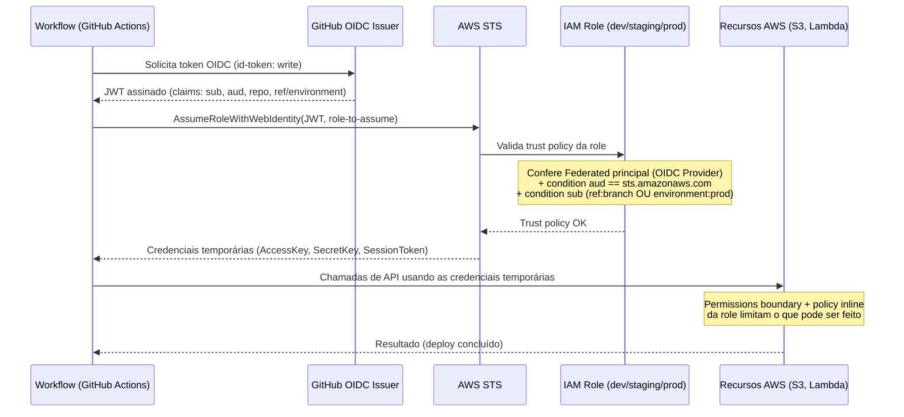

# github-actions-aws-oidc

Esqueleto de referência para autenticação federada **OIDC entre GitHub
Actions e AWS**, sem credenciais estáticas, seguindo um padrão de segurança
"Nível 2" (roles por ambiente + trust policy restrita por `sub` + permissions
boundary + tags obrigatórias). Veja [SECURITY.md](./SECURITY.md) para a
justificativa completa desse nível e quando evoluir para o Nível 3.

## O problema que este projeto resolve

Pipelines de CI/CD que fazem deploy na AWS frequentemente usam **access keys
de longa duração** guardadas como secret no GitHub (`AWS_ACCESS_KEY_ID` /
`AWS_SECRET_ACCESS_KEY`). Isso traz três problemas recorrentes:

1. **Credenciais que não expiram** — se vazarem (log, fork malicioso de PR,
   secret exposto por engano), continuam válidas até alguém rotacionar
   manualmente.
2. **Sem vínculo forte com a origem da chamada** — uma access key funciona
   igual não importa de onde veio a requisição; não há como amarrar
   nativamente "essa credencial só vale se vier deste repo, deste branch, ou
   deste ambiente aprovado".
3. **Rotação é trabalho manual** — alguém precisa lembrar de trocar a chave
   periodicamente, e geralmente ninguém lembra.

A federação OIDC resolve isso: o GitHub Actions emite um **token de curta
duração** (JWT, minutos de validade) a cada execução de workflow, assinado
pelo GitHub. A AWS confia nesse emissor (via IAM OIDC Provider) e troca esse
token por credenciais temporárias via `sts:AssumeRoleWithWebIdentity` — sem
nenhum secret de longa duração armazenado em lugar nenhum.

## Como funciona o fluxo OIDC (visão de alto nível)



Pontos-chave do claim `sub` (subject) do token OIDC, que é o que a trust
policy de cada role valida:

- **dev / staging**: `repo:<ORG>/<REPO>:ref:refs/heads/<branch>` — confia em
  um branch específico (por padrão, `main`).
- **prod**: `repo:<ORG>/<REPO>:environment:production` — só existe esse
  claim quando o job usa um [GitHub
  Environment](https://docs.github.com/actions/deployment/targeting-different-environments/using-environments-for-deployment)
  configurado com **Required reviewers**. Ou seja, a aprovação manual é
  imposta pela configuração do Environment no GitHub, e a AWS reforça isso
  exigindo esse claim exato na trust policy — dupla checagem, em duas
  camadas independentes.

## Estrutura do repositório

```
.
├── modules/
│   ├── oidc-provider/     # Cria o IAM OIDC Provider (1x por conta AWS)
│   └── iam-role/          # Role parametrizável: trust policy + boundary + tags
├── envs/
│   ├── shared/            # Bootstrap: OIDC Provider + permissions boundary
│   ├── dev/                # Role de dev (trust por branch)
│   ├── staging/             # Role de staging (trust por branch)
│   └── prod/               # Role de prod (trust por GitHub Environment)
├── policies/
│   ├── permissions-boundary.json        # Boundary em JSON puro (referência)
│   └── permissions-boundary.README.md   # Explicação statement-a-statement
├── .github/workflows/
│   ├── deploy-dev.yml
│   ├── deploy-staging.yml
│   └── deploy-prod.yml
├── SECURITY.md
└── README.md
```

## Passo a passo de instalação/uso

### 1. Pré-requisitos

- Terraform >= 1.5
- Uma conta AWS com permissão para criar IAM OIDC Provider, IAM Roles e IAM
  Policies (rode este passo com credenciais de operador humano, não via CI).
- Um repositório no GitHub (`<ORG>/<REPO>`) onde os workflows vão rodar.

### 2. Bootstrap (`envs/shared`) — uma única vez por conta

```bash
cd envs/shared
cp backend.tf.example backend.tf        # opcional, recomendado
cp terraform.tfvars.example terraform.tfvars
# edite terraform.tfvars com project/owner reais
terraform init
terraform plan
terraform apply
```

Anote os outputs `oidc_provider_arn` e `permissions_boundary_arn`.

### 3. Criar as roles de cada ambiente

Para cada ambiente (`dev`, `staging`, `prod`):

```bash
cd envs/dev   # ou staging, ou prod
cp backend.tf.example backend.tf
cp terraform.tfvars.example terraform.tfvars
# preencha com: project, owner, account_id, os dois ARNs do passo 2,
# github_org, github_repo, allowed_branch (dev/staging) ou github_environment (prod)
terraform init
terraform plan
terraform apply
```

Anote o output `role_arn` de cada ambiente.

### 4. Configurar o GitHub Environment de produção

No repositório GitHub: **Settings > Environments > New environment** →
nomeie exatamente como o valor usado em `github_environment` (padrão:
`production`) → habilite **Required reviewers** e adicione os aprovadores.

### 5. Atualizar os workflows com os ARNs reais

Substitua `<AWS_ACCOUNT_ID>` e `<PROJECT>` em
`.github/workflows/deploy-*.yml` pelos valores reais (ou migre para
variáveis/secrets do repositório, se preferir não deixar o ARN em texto
plano no workflow — o ARN de uma role não é secreto, mas manter como
variável facilita reuso entre workflows).

### 6. Testar

- Faça um push em `main` → o workflow `deploy-dev.yml` deve rodar e assumir
  a role de dev sem intervenção manual.
- Rode `deploy-prod.yml` (via push em `main` ou `workflow_dispatch`) → o job
  deve **pausar** aguardando aprovação no GitHub Environment antes de
  assumir a role de prod.

## Licença

MIT — veja [LICENSE](./LICENSE).
